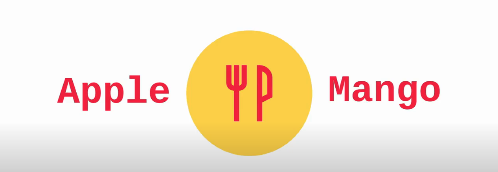

# 애플 망고(Apple Mango)

최종 수정: 2020.12.02

**애플 망고**는 기존의 맛집 리뷰 서비스들과는 차별화된 기능이 탑재된 맛집 리뷰 서비스입니다. **애플 망고**의 차별화된 특징은 음식점 사장님이 직접 자신의 메뉴 사진을 인스타그램 크롤링 데이터에서 선택하고 게시자에게는 쿠폰을 발행해준다는 점입니다. 음식 사진도 올리고 쿠폰도 받을 수 있는 기회가 있는 **애플 망고**에서 새로운 맛집 리뷰 서비스를 체험해보시길 바랍니다!

 **서비스 주소:** 현재 배포 작업 진행 중 

# 1. 사용화면

프론트엔드 리뉴얼 완료 후 재업데이트 예정입니다. 

# 개발자들

| 이름   | 담당 업무                 |
| ------ | ------------------------- |
| 박기훈 | 백엔드/프론트엔드 개발    |
| 문명기 | 백엔드/프론트엔드 개발    |
| 진소라 | 백엔드/프론트엔드 개발    |
| 김연수 | 백엔드/프론트엔드 개발    |
| 이은재 | 이미지 처리/데이터 크롤링 |

